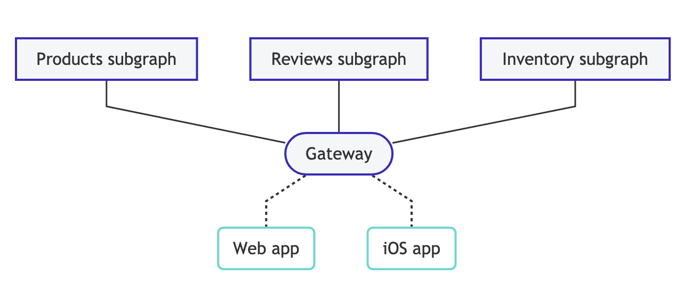

# Apollo Gateway Demo App
This application will demonstrate creating federated subgraphs, and wire up with an Apollo Gateway + Apollo Server.  It also has the [New Relic Apollo Server Plugin](https://github.com/newrelic/newrelic-node-apollo-server-plugin) loaded to demonstrate its functionality within NR1.

## What is the difference between a single GraphQL server and Federated GraphQL server?
A single data graph is a central, cost-effective, accessible GraphQL server.  It's typically the first foray into using GraphQL but as your catalog grows, and data access changes it's better to implement a federated GraphQL schema architecture.  It's akin to monolithic and microservice architectures. A federated GraphQL server allows you to define distinct subgraphs and compose them with a gateway server.  This allows flexibility in scaling of individual subgraphs and provides a decoupled implementation.





## New Relic Support
 * [Distributed Trace Example](https://staging-one.newrelic.com/-/0znQxNm43RV)
 * [Transaction Traces](https://staging-one.newrelic.com/-/0bEjOyambw6): Drill through all the subgraph apps


There is no special instrumentation to support a Federated GraphQL schema.  Users must ensure every subgraph and the gateway has loaded the [New Relic Apollo Server Plugin](https://github.com/newrelic/newrelic-node-apollo-server-plugin).  There were enhancements made to the plugin to allow for a consistent experience between a single GraphQL and Federated GraphQL server.


 * [Consistent Transaction Naming](https://github.com/newrelic/newrelic-node-apollo-server-plugin/pull/97)
 * [Proper Distributed Trace Segment Nesting](https://github.com/newrelic/newrelic-node-apollo-server-plugin/pull/95)
 * [Prevent Crashes for Queries that contain InlineFragment types](https://github.com/newrelic/newrelic-node-apollo-server-plugin/pull/100)

 We did try adding a RemoteGraphQLDataSource to the gateway but the only value came from when you did or could not instrument the Federated sub graphs.  It added spans for the subgraph requests and added the queries being executed on the subgraphs.  If this becomes a requested feature we could ship enhancements to allow to plugin the RemoteGraphQLDataSource.  But for Federated sub graphs that were instrumented with the New Relic Apollo Plugin there wasn't any valuable gains.  Here is an example repo that shows implementing a [RemoteGraphQLDataSource](https://github.com/bizob2828/basic-apollo-federation-demo)

 ## Features
  * Transaction traces for Gateway query and every subgraph request
  * Segments for Gateway GraphQL operations
  * Segments for subgraph GraphQL operations and resolvers
  * Distributed traces from Gateway to subgraphs with proper nesting
  * Associated metrics for each GraphQL span


## Setup
```sh
npm install
FEDERATED_APP=federated-demo NR_LICENSE=<license key> npm run dev
curl --location --request POST 'http://localhost:4000/' \
--header 'Content-Type: application/json' \
--data-raw '{"query":"query BooksByBranch {\n    libraries {\n          branch\n          booksInStock {\n            isbn,\n            title,\n            author\n          }\n          magazinesInStock {\n            issue,\n            title\n          }\n        }\n}","variables":{}}'

```
## Resources
 * [The gateway - Apollo Federation - Apollo GraphQL Docs](https://www.apollographql.com/docs/federation/gateway/)
 * [Introduction to Apollo Federation - Apollo Federation - Apollo GraphQL Docs](https://www.apollographql.com/docs/federation/))
 * [Principled GraphQL](https://principledgraphql.com/integrity#1-one-graph)
 * [Getting Started with Apollo Federation and Gateway](https://dev.to/mandiwise/getting-started-with-apollo-federation-and-gateway-4739)
